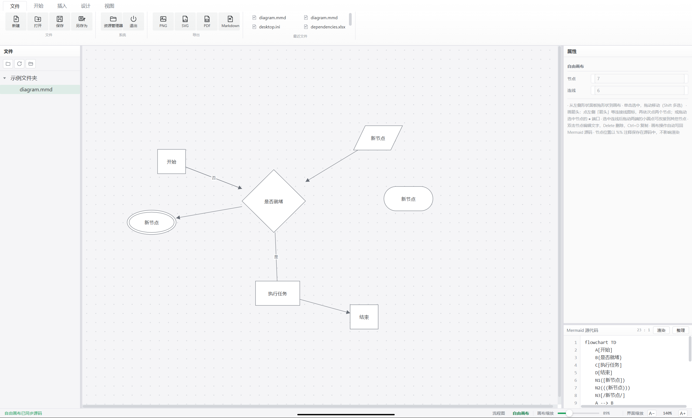
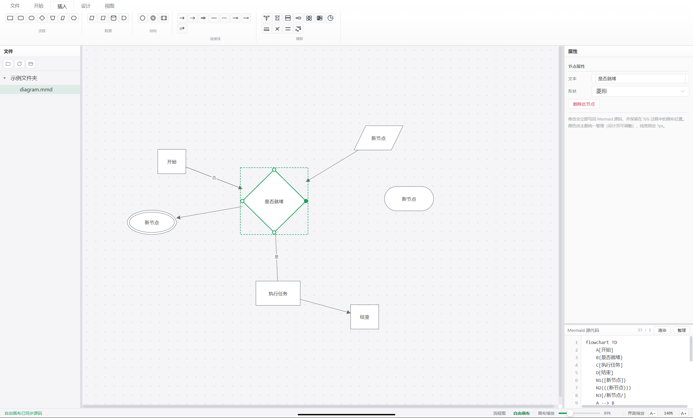

<p align="center">
  
</p>

<h1 align="center">MermaidEditor</h1>
<p align="center">Visio 风格的 Mermaid 离线桌面编辑器</p>
<p align="center"><b>完全离线 · Naive UI · 自由画布 · 双向同步</b></p>

<p align="center">
  <a href="https://www.electronjs.org/">
    
  </a>
  <a href="https://github.com/tusen-ai/naive-ui">
    
  </a>
  <a href="https://mermaid.js.org/">
    
  </a>
  <a href="https://opensource.org/licenses/MIT">
    
  </a>
</p>

## 功能特性

### 完全离线

所有依赖（Electron、Vue 3、Naive UI、Mermaid 渲染库）均随应用打包在本地，**不依赖任何网络**。打开即用，适合在内网 / 无网环境下绘制流程图、序列图、类图等。

### Visio 风格界面

界面参照 Visio 2016 布局：**文件 / 开始 / 插入 / 设计 / 视图** 五个功能区标签页、左侧文件管理器、中央画布、右侧属性面板与代码窗口、底部状态栏（缩放滑块）。UI 基于 [Naive UI](https://www.naiveui.com/) 组件库（主色 `#18a058`），配色统一。



### 自由画布模式

draw.io / Visio 式所见即所得操作：从「插入」页把形状**拖入**画布任意位置（自动对齐网格）；点「箭头」进入连线模式依次点两个节点画线，或拖动节点边缘的 **● 端口** 连到另一节点；选中连线后可**拖动端点改接**；双击节点就地编辑文字、**双击箭头编辑连线标签**；Delete 删除、Ctrl+D 复制、方向键微调。

### 画布浏览

- **滚轮缩放**：在画布上滚动鼠标滚轮即可缩放画布，以鼠标位置为锚点（放大 / 缩小 0.2×–8×）；状态栏滑块与 Ctrl+=/-/0/1 快捷键同样作用于画布
- **空白拖拽平移**：按住画布空白处拖动即可平移视口，重绘后位置保持；Esc 恢复
- **画布铺满窗口**：画布自动铺满整个中央区域，窗口缩放画布跟随扩展，内容始终 1:1 显示
- **界面缩放**：状态栏右下角「界面缩放 A−/A+」整体放大界面文字与图标（70%–200%，自动记忆），画布与代码区保持原尺寸

### 双向同步

画布上的所有操作（增删改、样式、位置）自动写回 Mermaid 源码（`style` / `linkStyle` 指令）；在代码区直接改源码，画布自动重新导入。节点位置以 `%% pos:节点名:x,y` 注释保存在源码末尾——它是合法的 Mermaid 注释，不影响任何渲染器解析，因此位置在保存、重新打开、源码小改后依然保留。

### 实时渲染

编辑源码自动渲染（可关闭），Ctrl+Enter 立即渲染；点击画布形状 → 高亮并定位到源码，双击 → 跳转编辑。撤销 / 重做（Ctrl+Z / Ctrl+Y）对画布操作同样生效。渲染错误在画布顶部以提示条显示，可一键关闭。

### 文件与同步

- 左侧文件管理器（VS Code 式树状）：文件夹懒加载展开、点击打开并高亮、状态自动记忆、顶部按钮「选择文件夹 / 刷新 / 资源管理器显示」；未打开文件夹时居中显示引导提示
- 外部实时同步：外部程序修改当前文件自动载入，本应用编辑自动写回磁盘（适合与 Typora / VSCode 协同编辑）
- 新建 / 打开 / 保存 / 另存为（.mmd / .md / .txt）、最近文件、拖入窗口打开、关闭前未保存确认、每 4 秒自动草稿

### 导出

PNG（3× 高清）、SVG 矢量图、PDF（A4）、Markdown 代码块。

## 使用

要求 **Node.js 18+**。`node_modules` 不随 git 仓库保存，克隆 / 下载源码后需先重建依赖，再启动应用：

```bash
# 1. 克隆或解压源码后，安装依赖（重建 node_modules）
npm install

# 2. 启动应用
npm start
```

> **离线环境**：`npm install` 需要一次网络访问下载依赖。装完后所有依赖（Electron、Vue 3、Naive UI、Mermaid）都在本地 `node_modules`，之后完全离线可用。已有 `node_modules` 时可直接 `npm start` 启动，无需重复安装。

### 从已有 node_modules 直接启动

若当前目录已安装过依赖（或从别处拷贝了 `node_modules`），跳过安装直接启动：

```bash
npm start
```

### 构建 / 打包

使用 [electron-builder](https://www.electron.build/) 打包为各平台安装程序：

```bash
# Windows 安装包（NSIS，x64 → build-out/ 目录）
npm run build:win

# Linux 安装包（AppImage + deb → build-out/ 目录，需在 Linux 系统上运行）
npm run build:linux

# 同时构建 Windows 与 Linux（本机 Windows 上 Linux 部分不可用）
npm run build:all
```

> 说明：
> - 打包产物输出到 `build-out/` 目录（已在 `.gitignore` 中忽略，不入库）
> - Windows 安装包：`MermaidEditor Setup <版本>.exe`（NSIS 安装向导）
> - Linux 产物：`MermaidEditor-<版本>.AppImage`（免安装直接运行）+ `.deb`（Debian/Ubuntu 安装包）
> - **Linux 包只能在 Linux 系统上构建**（AppImage 需要 mksquashfs 等 Linux 工具，Windows 上无法生成）
> - Windows 图标由 `assets/icon.png` 自动生成，Linux 图标同样取自该文件

### 快捷键

| 快捷键 | 功能 |
|---|---|
| Ctrl+N / Ctrl+O / Ctrl+S / Ctrl+Shift+S | 新建 / 打开 / 保存 / 另存为 |
| Ctrl+Z / Ctrl+Y | 撤销 / 重做 |
| Ctrl+Enter | 立即渲染 |
| Ctrl+= / Ctrl+- / Ctrl+0 / Ctrl+1 | 放大 / 缩小 / 100% / 适应窗口 |
| Delete | 自由画布：删除选中对象 |
| Ctrl+D | 自由画布：复制选中节点 |
| F12 | 开发者工具 |

### 自由画布说明

- 自由画布仅支持流程图（flowchart）；其他图类型请在源码模式下编辑
- Mermaid 本身不支持自由坐标，自动布局类图位置由 mermaid 计算——这是格式层面的固有约束，已用 `%% pos:` 注释尽量保留画布位置
- 元素级编辑（选中节点 / 连线改样式）仅支持 flowchart；节点样式写入 `style 节点名 ...`，连线样式写入 `linkStyle 序号 ...`

## 项目结构

```
.gitignore              git 忽略规则（node_modules/ 等不入库）
main.js                 Electron 主进程（窗口、文件对话框、导出写盘）
preload.js              上下文隔离桥（window.api）
package.json            依赖声明与启动脚本（npm install / npm start）
renderer/
  index.html            界面骨架
  css/visio.css         Visio 风格样式
  js/icons.js           内联 SVG 图标
  js/data.js            形状 / 连线 / 模板 / 设计选项数据
  js/editor.js          代码编辑器（行号 + 撤销历史）
  js/render.js          mermaid 渲染、点击映射、缩放、源码解析、画布布局坐标
  js/canvas.js          自由画布引擎（draw.io 式直接操作 + 源码双向同步）
  js/properties.js      右侧属性面板
  js/export.js          PNG / SVG / PDF / Markdown 导出
  js/app.js             主控制器（功能区、拖放、文件、快捷键、草稿）
```

> 版本管理：项目使用 git，`node_modules/` 已被 `.gitignore` 忽略，克隆后执行 `npm install` 重建依赖。

## 贡献

欢迎提交 Issue 与 Pull Request。

## 许可证

[MIT](https://opensource.org/licenses/MIT)

本项目的界面组件库 [Naive UI](https://github.com/tusen-ai/naive-ui) 与图表渲染库 [Mermaid](https://github.com/mermaid-js/mermaid) 均基于 MIT 许可证。
